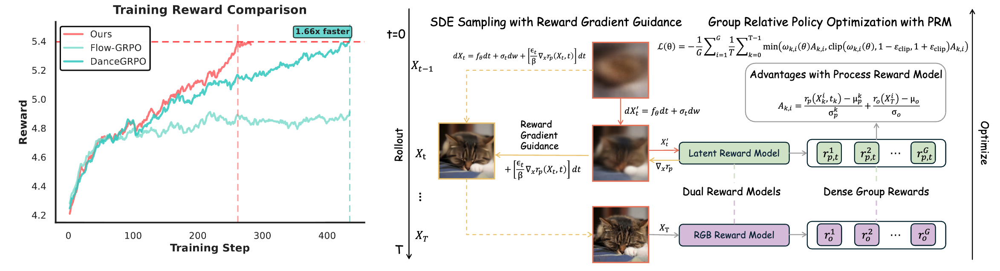

#  Euphonium: Steering Video Flow Matching via Process Reward Gradient Guided Stochastic Dynamics

[](https://arxiv.org/abs/2602.04928)

Euphonium is a novel framework for steering video flow matching via process reward gradient guided stochastic dynamics. It employs a Dual-Reward Group Relative Policy Optimization algorithm that combines latent process rewards for efficient credit assignment and pixel-level outcome rewards for visual fidelity, significantly accelerating training convergence.

## 📝 TODO

- [x] Release training scripts
- [x] Release inference scripts
- [ ] Release reward model checkpoints

## Pipeline

<div align="center">
  
</div>

## Abstract

While online Reinforcement Learning has emerged as a crucial technique for aligning flow matching models with human preferences, current approaches are hindered by inefficient exploration during training rollouts. Relying on undirected stochasticity and sparse outcome rewards, these methods struggle to discover high-reward samples, resulting in data-inefficient and slow optimization. To address these limitations, we propose Euphonium, a novel framework that steers generation via process reward gradient guided dynamics. Our key insight is to formulate the sampling process as a theoretically principled Stochastic Differential Equation that explicitly incorporates the gradient of a Process Reward Model into the flow drift. This design enables dense, step-by-step steering toward high-reward regions, advancing beyond the unguided exploration in prior works, and theoretically encompasses existing sampling methods (e.g., Flow-GRPO, DanceGRPO) as special cases. We further derive a distillation objective that internalizes the guidance signal into the flow network, eliminating inference-time dependency on the reward model. We instantiate this framework with a Dual-Reward Group Relative Policy Optimization algorithm, combining latent process rewards for efficient credit assignment with pixel-level outcome rewards for final visual fidelity. Experiments on text-to-video generation show that Euphonium achieves better alignment compared to existing methods while accelerating training convergence by 1.66x.

## 🚀 Quick Start

### Clone the Repository

```bash
git clone --recursive https://github.com/zerzerzerz/Euphonium.git
cd Euphonium
```

> **Note**: The `--recursive` flag is required to properly initialize the submodules.

### Submodules

This repository contains the following submodules in `third_party/`:

| Submodule      | Description                                                                     | Repository                                         |
| -------------- | ------------------------------------------------------------------------------- | -------------------------------------------------- |
| **Latent_PRM** | Latent-space Process Reward Model for training rollout reward gradient guidance | [GitHub](https://github.com/zerzerzerz/Latent_PRM) |
| **SoliReward** | Pixel-space Outcome Reward Model for visual fidelity                            | [GitHub](https://github.com/lian700/SoliReward)    |

## 🔧 Environment Setup

### Prerequisites

- **CUDA 12.4** is required for optimal performance and compatibility.

### Installation

```bash
# Run the environment setup script to handle all dependencies
bash scripts/env_setup.sh
```

### Download Pretrained Models

The following models are required:

- **HunyuanVideo**: Main generation model
  - Download from [Hugging Face](https://huggingface.co/tencent/HunyuanVideo)

- **Reward Models** (Required):
  - **SoliReward** (pixel-space ORM, e.g., InternVL3-1B) - **Required** - *Checkpoints coming soon*
  - **Latent PRM** (latent-space Process Reward Model) - **Required** - *Checkpoints coming soon*
  - VideoAlign reward model - **Optional**

---

## 📊 Data Preprocessing

Data preprocessing converts raw text prompts into precomputed text embeddings to accelerate training. The output index uses **absolute paths** for direct use across different working directories.

### Input/Output Format

**Input Example** (`prompts.txt`):
```text
A dog running in the park.
A cat sleeping on the couch.
A person playing basketball.
```

**Output Structure**:
```
output_dir/
├── prompt_embed/           # Text embedding vectors (.pt files)
├── prompt_attention_mask/  # Attention masks (.pt files)
└── videos2caption.json     # Data index file (contains absolute paths)
```

### Using the Preprocessing Script

1. **Prepare your prompt file**: Create a text file with one prompt per line.
2. **Configure and Run**:
   Edit `scripts/preprocess_hunyuan_text_embeddings.sh` to set `WORKDIR`, `MODEL_PATH`, and `PROMPT_PATH`.

   ```bash
   bash scripts/preprocess_hunyuan_text_embeddings.sh
   ```

---

## 🚀 GRPO Training

### Training Configuration

Edit `scripts/train_grpo_hunyuan.sh` to configure variables:
- `HUNYUAN_VIDEO_PATH`: Path to the base model.
- `TRL_MODEL_PATH`: Path to your reward model.
- `data_json_path`: Path to `videos2caption.json` from the preprocessing step.

### Multi-node Training

**Recommended**: Use `pssh` (parallel-ssh) to launch training across multiple nodes.

1. **Create a hostfile**: List one IP per line.
   ```text
   192.168.1.1
   192.168.1.2
   ```

2. **Run on each node**:
   ```bash
   export hostfile=/path/to/hostfile
   bash scripts/train_grpo_hunyuan.sh
   ```

   Or use `pssh` for parallel launch:
   ```bash
   pssh -h hostfile -i "cd /path/to/Euphonium && bash scripts/train_grpo_hunyuan.sh"
   ```

### Logs and Monitoring

- **TensorBoard**: Checkpoints and logs are saved in `${output_base_dir}/tensorboard/`.
- **Logs**: Detailed execution logs are in `${output_base_dir}/logs/`.

---

## ⚙️ Important Training Parameters

The following environment variables control the reward models and RGG (Reward Gradient Guidance) behavior:

### Reward Model Configuration

- **`TRL_CORE_ENABLED`**: Enable pixel-space ORM (SoliReward)
- **`LATENT_REWARD_IN_TRL_REWARD_ENABLED`**: Enable latent-space PRM
- **`LATENT_REWARD_IN_TRL_REWARD_COEF`**: Coefficient for latent reward in total reward calculation (default: 0, computed separately in PRM advantage)

### Process Reward Model (PRM) Settings

- **`PROCESS_LATENT_REWARD_ENABLED`**: Enable process latent reward model computation
- **`PROCESS_LATENT_REWARD_SAMPLING_ENABLED`**: Enable RGG (Reward Gradient Guidance) during sampling
- **`PROCESS_LATENT_REWARD_TRAINING_ENABLED`**: ⚠️ **Deprecated** - Not used

### RGG Configuration

- **`USE_REWARD_GUIDED_MEAN_FOR_LOGPROB`**: Use RGG to compute mean when calculating log probability during sampling
- **`USE_REWARD_GUIDED_MEAN_FOR_LOGPROB_TRAINING`**: Use RGG to compute mean when calculating log probability during training
- **`PROCESS_LATENT_REWARD_GUIDANCE_SCALE`**: Guidance scale coefficient for RGG strength
- **`USE_DELTA_T_FOR_GRADIENT_SCALING`**: Whether to multiply RGG coefficient by delta_t (step size)

### Advantage Computation

- **`PROCESS_REWARD_ADVANTAGE_MODE`**: Mode for computing dual-reward advantage
  - `both`: Use both PRM and ORM
  - `none`: Use only ORM (Outcome Reward Model)
  - `only`: Use only PRM (Process Reward Model)

### Gradient Estimation

- **`SPSA_REWARD_ENABLED`**: Use SPSA-estimated ORM gradient for latents

---

## 🎬 Inference/Visualization

### Run Inference

Edit `scripts/vis_hunyuanvideo.sh` to set your model and data paths, then run:

```bash
bash scripts/vis_hunyuanvideo.sh
```

---

## 📚 Citation

If you use Euphonium, please cite our paper:

```bibtex
@article{zhong2026euphonium,
  title={Euphonium: Steering Video Flow Matching via Process Reward Gradient Guided Stochastic Dynamics},
  author={Zhong, Ruizhe and Lian, Jiesong and Mi, Xiaoyue and Zhou, Zixiang and Zhou, Yuan and Lu, Qinglin and Yan, Junchi},
  journal={arXiv preprint arXiv:2602.04928},
  year={2026}
}
```


## 📄 License

Apache License 2.0

## Acknowledgements

We would like to thank the following projects for their contributions:
- https://github.com/XueZeyue/DanceGRPO
- https://github.com/yifan123/flow_grpo
- https://github.com/hao-ai-lab/FastVideo
- https://github.com/huggingface/diffusers
- https://github.com/Tencent-Hunyuan/HunyuanVideo
